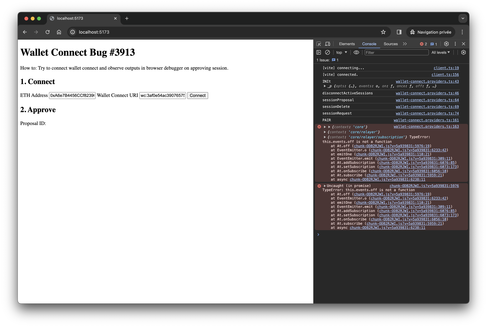

Sample repo for WalletConnect bug https://github.com/WalletConnect/walletconnect-monorepo/issues/3913

## Workaround

Downgrade `@walletconnect/web3wallet` to `v1.9.1`

## Root cause of the issue

When a Node polyfill is used, the newest version of `@walletconnect/web3wallet` throws error `this.events.off is not a function`.

## Reproduce the issue

Clone and start the sample:

```
git clone https://github.com/peterpeterparker/web3wallet-issue-3913
cd web3wallet-issue-3913
npm ci
npm run dev
```

Try to establish a connection for example with https://app.uniswap.org/swap?chain=goerli

## Error

> wallet-connect.providers.ts:163 {context: 'core'} {context: 'core/relayer'} {context: 'core/relayer/subscription'} TypeError: this.events.off is not a function
> at At.off (chunk-ODB2RJWI.js?v=cc7e6155:5976:19)
> at EventEmitter.o (chunk-ODB2RJWI.js?v=cc7e6155:6233:42)
> at emitOne (chunk-ODB2RJWI.js?v=cc7e6155:110:21)
> at EventEmitter.emit (chunk-ODB2RJWI.js?v=cc7e6155:309:11)
> at At.addSubscription (chunk-ODB2RJWI.js?v=cc7e6155:6076:85)
> at At.setSubscription (chunk-ODB2RJWI.js?v=cc7e6155:6073:173)
> at At.onSubscribe (chunk-ODB2RJWI.js?v=cc7e6155:6056:10)
> at At.subscribe (chunk-ODB2RJWI.js?v=cc7e6155:5959:21)
> at async chunk-ODB2RJWI.js?v=cc7e6155:6238:11

